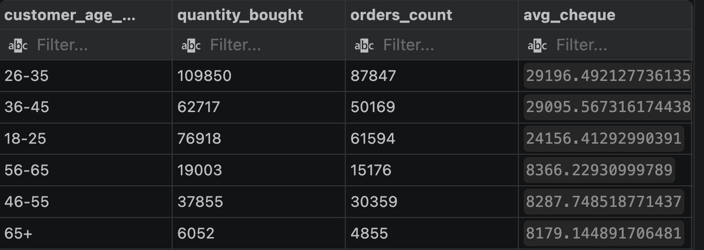
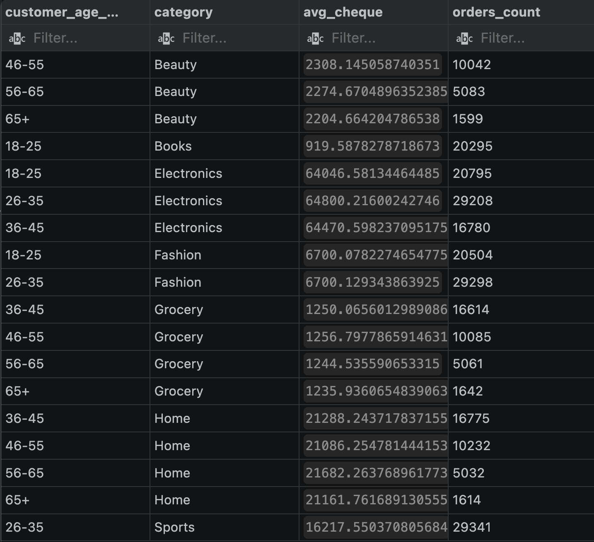
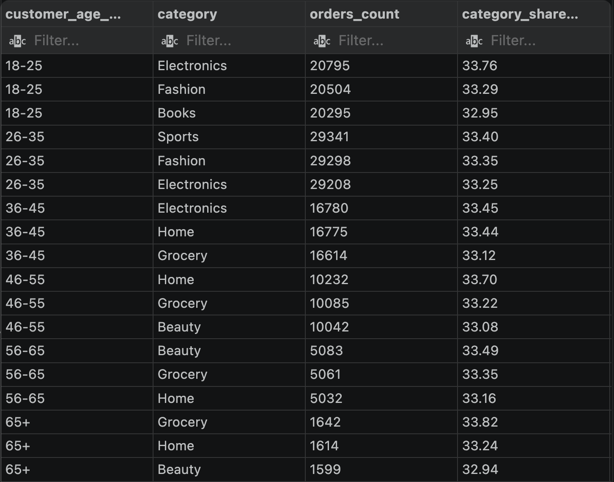

# Age group vs. average order value

## Question

Does a customer's age affect how much they spend per order? Starting assumption: younger customers order more often but spend less per order, while older customers order less often but spend more.

## Step 1: Overview by age group

```sql
select
    customer_age_group,
    sum(quantity) as quantity_bought,
    count(order_id) as orders_count,
    avg(total_amount) as avg_cheque
from sales
group by customer_age_group
order by avg_cheque desc
```


Not what was expected. Instead of a gradual decline with age, there's a hard break: the 18-45 groups average 24-29K per order, and everything 46+ drops to around 8K. The line falls exactly between 45 and 46, which is a suspiciously clean cutoff for something that's supposed to be organic customer behavior.

## Step 2: Ruling out sample size

First guess: the jump is a small-sample artifact, with a handful of outliers skewing the average in the older groups. Doesn't hold up. Even the smallest group (65+) has close to 5,000 orders, which is enough to rule out noise. Basket size (quantity per order) is also nearly identical across all groups, around 1.25 items, so it's not a cart-composition difference either.

## Step 3: Checking within product categories

Second guess: maybe prices for the same products are quietly lower for older age groups in this dataset. Tested by joining in the products table and grouping by age group and category together.

```sql
select
    s.customer_age_group,
    p.category,
    avg(s.total_amount) as avg_cheque,
    count(s.order_id) as orders_count
from sales s
join products p on s.product_id = p.product_id
group by s.customer_age_group, p.category
order by p.category, s.customer_age_group
```


Within the same category, average order value barely moves across age groups (Grocery, for example: 1,250 vs. 1,235 for 65+, under a 1% difference). So it's not pricing. Second hypothesis rejected.

## Step 4: Finding the real cause

Looking closer at the result set, each age group only showed up next to a handful of categories, not all of them. To check that properly, the share of each category within each age group's total orders was calculated directly:

```sql
with age_totals as (
    select
        customer_age_group,
        count(order_id) as total_orders
    from sales
    group by customer_age_group
)

select
    s.customer_age_group,
    p.category,
    count(s.order_id) as orders_count,
    round(count(s.order_id) * 100.0 / t.total_orders, 2) as category_share_percent,
    to_char(sum(total_amount), 'FM999,999,999,999,999') as total_revenue
from sales s
join products p on s.product_id = p.product_id
join age_totals t on s.customer_age_group = t.customer_age_group
group by s.customer_age_group, p.category, t.total_orders
order by s.customer_age_group, category_share_percent desc
```

That confirmed it. Every age group only orders from three categories out of seven, and within those three, the split is close to perfectly even (~33% each). 18-25 only buys Electronics, Fashion, and Books. 46-55 only buys Home, Grocery, and Beauty. No age group's category set overlaps with another, and none of them ever place an order outside their assigned three.

## Conclusion

The gap in average order value between age groups isn't real customer behavior, it's a side effect of how the dataset was built. Each age group was hard-assigned a fixed set of three product categories during generation, with orders spread almost evenly across that set. The expensive categories (Electronics, Sports) only ended up assigned to the 18-45 groups, and the cheaper ones (Grocery, Beauty, Home) to 46+, which is what creates the illusion of an age-based spending gap.

**Takeaway for working with datasets like this one:** before reading a segment gap in a metric as a behavioral pattern, check whether that segment is artificially tied to another dimension at the level of how the data itself was generated.