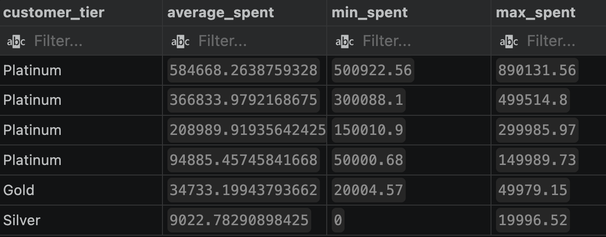
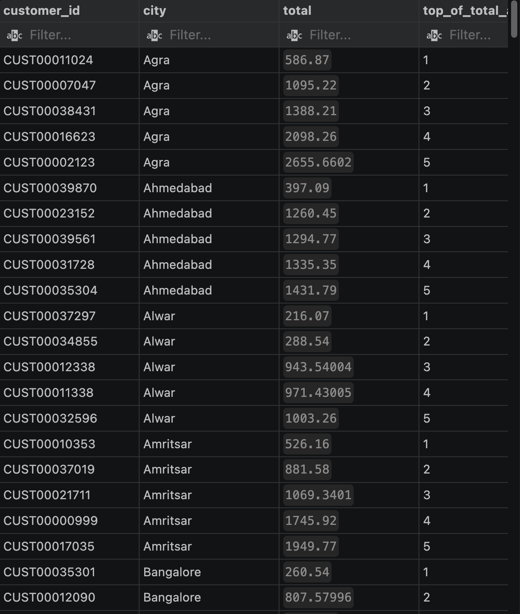
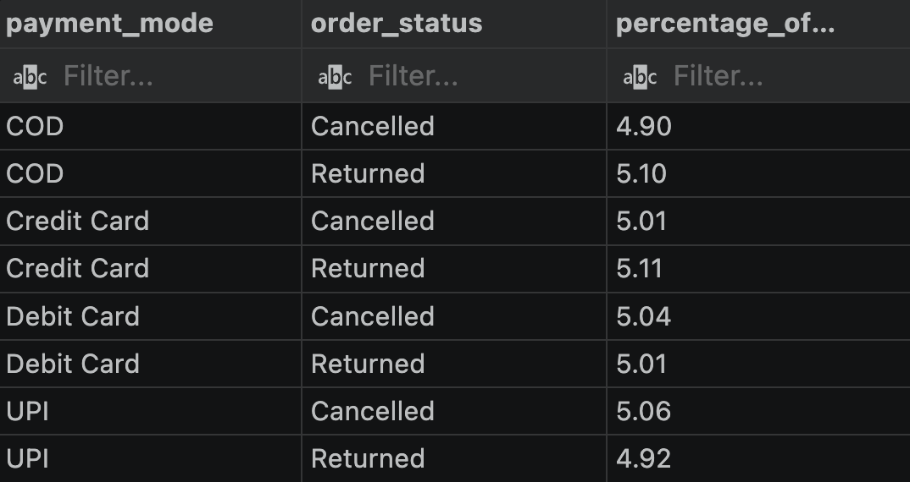
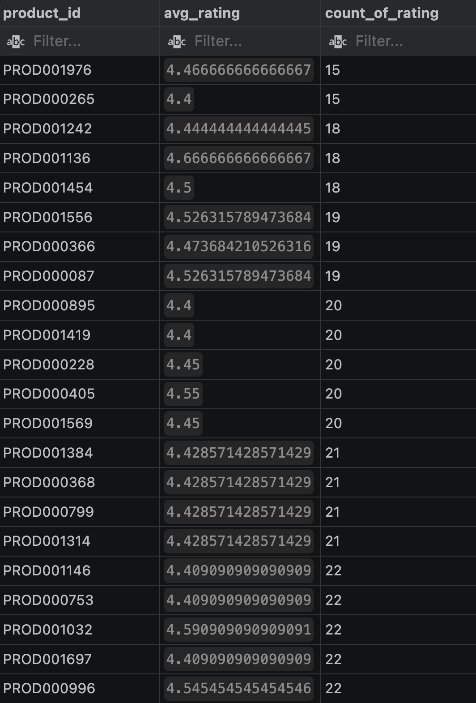
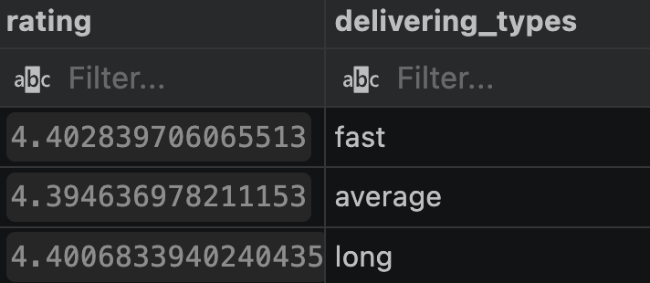
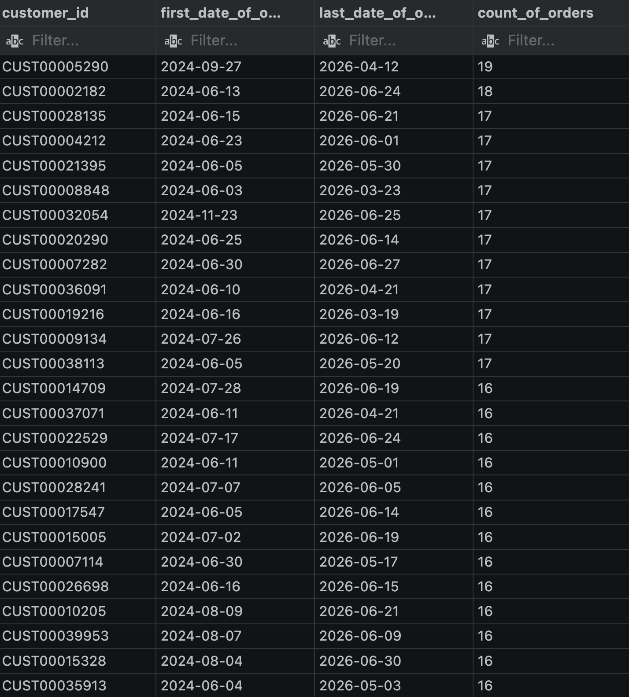
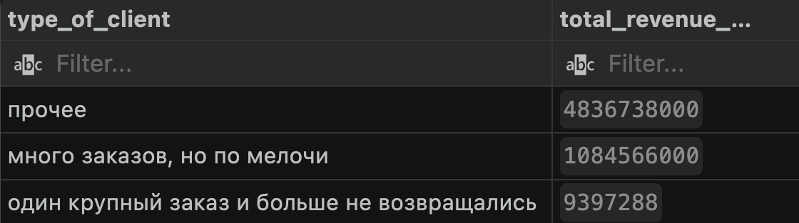

# E-Commerce Sales Analysis
SQL analysis of a synthetic e-commerce dataset modeled on the Indian market.
## About the Project

Eight business questions tested using SQL on the  `customers` / `products` / `sales` : customer segmentation, spending patterns, product performance, delivery and payment behavior. Each query was initially treated as a hypothesis and tested against the data, rather than being taken at face value.

One thing came up again and again while doing this: because the dataset is synthetically generated, several "obvious" real-world patterns simply didn't hold. Older customers didn't spend less per order, slower delivery didn't correlate with lower ratings, and so on. Investigating the reasons why a particular result appeared to be incorrect became just as important a part of the analysis as writing the queries themselves, and all such instances are documented below.
## Dataset
The dataset contains three related tables:

* `customers` - customer information and registration data
* `products` - product catalog, pricing, discounts, ratings, and stock
* `sales` - transactional sales records

The tables are connected through `Customer_ID` and `Product_ID`.

The dataset contains synthetic data representing an Indian e-commerce business. It was generated using Python for educational and portfolio purposes and does not contain real customer information.

## Analysis

### 1. Customer tier boundaries and Platinum segmentation

Theory going in: the Silver/Gold/Platinum tiers weren't behavioral segments but hard cutoffs. Hit a spending threshold, get bumped up a tier, and Platinum is just "everyone who cleared Gold," with no upper bound. The data confirmed it: each tier has a suspiciously clean floor and ceiling.

That raised a second problem: a customer who just barely qualified for Platinum and one who spent 840,000 more than the minimum are both labeled "Platinum," which flattens a huge behavioral difference. So Platinum was split further into its own sub-segments (Entry, Strong, Best, VIP) to make the tier actually mean something.

```sql
SELECT
customer_tier,
avg(total_spent) as average_spent,
min(total_spent) as min_spent,
max(total_spent) as max_spent,
    case
        when total_spent >50000 and total_spent<=150000 then 'Entry Platinum'
        when total_spent >150000 and total_spent<=300000 then 'Strong Platinum'
        when total_spent >300000 and total_spent<=500000 then 'Best Platinum'
        when total_spent >500000 then 'VIP'
        else 'Not Platinum'
    end as platinum_segment
from customers
group BY
customer_tier,
platinum_segment
order BY
average_spent desc
```

**Result:** the Platinum tier splits into four clearly separated groups, from ~95K average spend at the entry level up to ~585K for VIP. Confirms that "Platinum" alone was hiding a wide range of actual spending behavior.

---



### 2. Top 5 spenders per city

Simple ranking problem, solved with a window function: partition customers by city, rank them by total spend, and keep the top 5 per city.

```sql
with city_totals as (
    select
        customer_id,
        city,
        sum(total_amount) as total,
        row_number() over (partition by city order by sum(total_amount) desc) as rank_in_city
    from sales
    group by customer_id, city
)
select *
from city_totals
where rank_in_city <= 5
```

**Result:** a clean top-5-per-city leaderboard, ready to hand to a regional marketing or loyalty team.

---


### 3. Age group vs. category spending

*(Shortened version. The full step-by-step investigation, including the two dead-end hypotheses that came before this, lives in a separate file: [full breakdown](Business%20Questions%20%26%20Hypotheses/full%20breakdown.md))*

Starting point: average order value drops sharply after age 45 (~29K for 26-45 vs. ~8K for 46+), with a suspiciously clean break exactly at that boundary. Sample size and basket size ruled out as causes. The real reason turned out to be structural: the dataset assigns each age group a fixed set of exactly 3 product categories (out of 7), split almost perfectly evenly (~33% each) within that group. The expensive categories (Electronics, Sports) only landed on the 18-45 groups.

```sql
with age_totals as (
    select
        customer_age_group,
        count(order_id) as total_orders
    from sales
    group by customer_age_group
)

select
    s.customer_age_group,
    p.category,
    count(s.order_id) as orders_count,
    round(count(s.order_id) * 100.0 / t.total_orders, 2) as category_share_percent,
    to_char(sum(total_amount), 'FM999,999,999,999,999') as total_revenue
from sales s
join products p on s.product_id = p.product_id
join age_totals t on s.customer_age_group = t.customer_age_group
group by s.customer_age_group, p.category, t.total_orders
order by s.customer_age_group, category_share_percent desc
```

**Result:** the age/spending gap isn't behavioral, it's an artifact of how the dataset was generated, with category access hard-tied to age group. Lesson for next time: before reading a segment gap as a behavioral pattern, check whether the segment is artificially tied to another dimension in the data itself.

---


### 4. Problem order rate by payment method

> Finance asked: "I want to understand which payment methods are most often tied to cancelled or returned orders. Give me the percentage of problem orders for each payment method."

```sql
with gen AS 
(SELECT
    payment_mode,
    count(order_status) as gen_count
from
    sales
group BY
     payment_mode)

select
    s.payment_mode,
    s.order_status,
    round(((count(s.order_status)*100.0) / g.gen_count),2) as percentage_of_problem_orders
from
     sales s
join gen g on g.payment_mode = s.payment_mode
where
order_status in ('Cancelled', 'Returned')
group BY
    s.payment_mode,
    s.order_status,
    g.gen_count
```

**Result:** every payment method comes out within a tight 4.9-5.1% band for both cancellations and returns, no method stands out as riskier than another. At first, it seemed that this might be a random coincidence linked to the method used to generate the sample data; it later transpired that the entire dataset was synthetic, which explains the flat, virtually uniform distribution. Consequently, in this dataset, the payment method has no real predictive value with regard to order issues.

---



### 5. Underrated products (high rating, low review count)

> Product asked: "Find products rated above the database-wide average rating, but with fewer reviews than the database-wide average review count. These could be underrated products."

```sql
select
    product_id,
    avg(rating) as avg_rating,
    count(rating) as count_of_rating
FROM
     sales
GROUP BY
    product_id
having 
avg(rating) > 
        (select avg(avg_rating) from 
        (
        select
            avg(rating) as avg_rating
        from
            sales
        GROUP BY
        product_id
        ) a
        )
and count(rating) <
    
    (select
         avg(cnt) from
        (
        select
            count(rating) as cnt
        from
            sales
        GROUP BY
        product_id 
        ) b
    )
order BY
count_of_rating
```

**Result:** a list of products that are rated well above average but haven't accumulated many reviews yet. Good candidates for a visibility or marketing push, since the demand signal is there but discovery isn't.

---



### 6. Delivery speed vs. rating correlation

> An analyst asked: "I want to see the average number of days between order date and delivery date, and whether longer delivery actually means a lower final rating. Break the result into fast / average / long delivery ranges — pick the cutoffs yourself."

```sql
with dayli AS(
SELECT
order_id,
product_id,
delivery_date::date - order_date::date as days_of_delivering,
rating as rating
from sales
),
test AS(
    SELECT
    product_id,
    avg(delivery_date::date - order_date::date) as avg_days_of_delivering
    from sales
    group BY
    product_id  
)
SELECT
avg(d.rating) as rating,
case
    when t.avg_days_of_delivering - d.days_of_delivering >= 1 then 'fast'
    when t.avg_days_of_delivering - d.days_of_delivering < 1 and t.avg_days_of_delivering - d.days_of_delivering > -1 then 'average'
    when t.avg_days_of_delivering - d.days_of_delivering <= -1 then 'long'
end as delivering_types
from dayli d 
join test t on t.product_id = d.product_id
group BY
delivering_types
```

**Result:** average rating is flat across fast, average, and long delivery (4.39-4.40), no real-world "slow delivery tanks your rating" effect shows up. Another case of the synthetic data not encoding a relationship you'd expect to see in a real store.

---



### 7. Most loyal customers

Straightforward loyalty view: first order date, last order date, and total order count per customer, ranked by order count.

```sql
SELECT
    customer_id,
    min(order_date) first_date_of_order,
    max(order_date) as last_date_of_order,
    count(order_id) as count_of_orders
from sales
group BY
customer_id
order by
 count_of_orders desc
```

**Result:** a ranked list of the most frequent repeat buyers, spanning as many as 18-19 orders over roughly two years. These are the customers most worth retaining.

---



### 8. One-time big spenders vs. frequent small buyers

The most demanding query in the project. Two customer archetypes to isolate and compare against everyone else, purely on revenue contribution.

> Sales asked: "We suspect there are customers who made one large order and never came back, and customers who order often but cheaply. Split all customers into these two categories and show how much revenue each category brings in."

```sql
with customer_metrics AS (
    SELECT
        customer_id,
        count(order_id) as personal_order_count,
        avg(total_amount) as personal_avg_price,
        sum(total_amount) as personal_total_spent
    from sales
    group by customer_id
),
average_price AS(
    select
    avg(total_amount) as avrg_cheque
from 
    sales
),
average_number_of_orders AS(
    SELECT
    avg(count_of_orders_per_person) as final_count_of_orders from
    (
        SELECT
        count(order_id) as count_of_orders_per_person
from
    sales
group BY
    customer_id
) count_of_orders
),

final_query AS (
SELECT
    case
        when c.personal_order_count = 1 and c.personal_avg_price > p.avrg_cheque then 'один крупный заказ и больше не возвращались'
        when c.personal_order_count > a.final_count_of_orders and c.personal_avg_price < p.avrg_cheque then 'много заказов, но по мелочи'
        else 'прочее'
    end type_of_client,
    personal_total_spent
FROM
    sales s
cross join average_number_of_orders a
cross join average_price p
join customer_metrics c on c.customer_id = s.customer_id
group BY
    s.customer_id,
    a.final_count_of_orders,
    c.personal_order_count,
    c.personal_avg_price,
    p.avrg_cheque,
    c.personal_total_spent
)

SELECT
type_of_client,
sum(personal_total_spent) as total_revenue_per_category
from final_query 
group BY
type_of_client
order BY
total_revenue_per_category desc
```

**Result:** neither archetype turned out to dominate. The "other" group (customers who don't cleanly fit either story) brings in by far the most revenue, followed by frequent small buyers, with one-time big spenders contributing the least of the three. So optimizing purely around one-time big spenders or frequent small buyers would mean ignoring where most of the revenue actually comes from.

--- 



## Dataset Attribution

The dataset was created by the original author as a synthetic e-commerce dataset for educational and portfolio purposes.

Dataset source: Kaggle
Original author: [JATIN KHANDELWAL112]
Original dataset: [[KAGGLE DATASET URL](https://www.kaggle.com/datasets/jatinkhandelwal112/indian-e-commerce-sales-analytics-dataset)]

The dataset is published under the CC0: Public Domain dedication. It was not created by me; all analysis and SQL queries in this repository are my own work.

## Disclaimer

The dataset is synthetic and should not be interpreted as real-world Indian e-commerce data or used to draw conclusions about actual customers, companies, or markets.

---

Also in this repo: a [20 training queries based on this dataset](practice) folder with ~20 shorter warm-up queries used to drill functions: window functions, join's and etc. They are separate from the analysis above and kept as reference only.